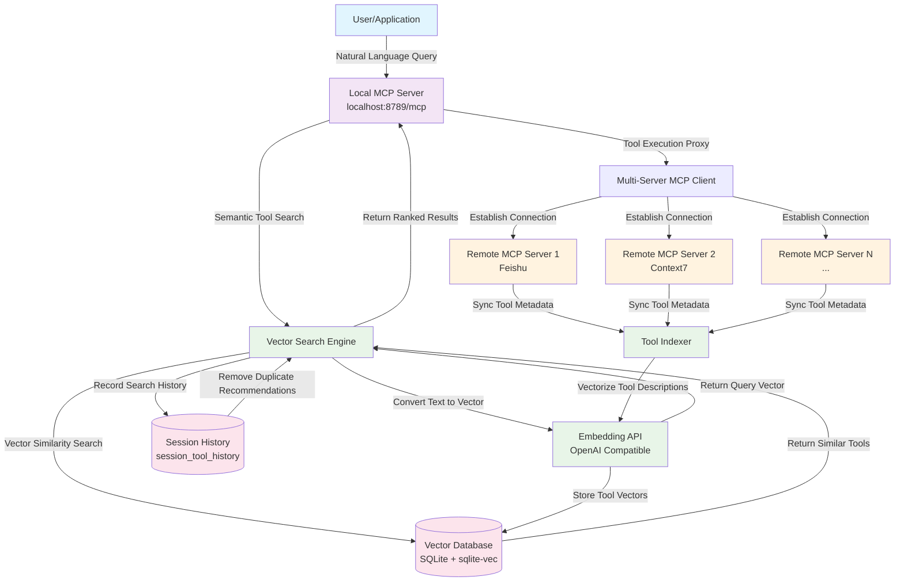

# Dext - Advanced MCP Tool Retrieval & Vector Indexing System

[中文文档](README.zh-CN.md) | English

**Dext** is an advanced MCP (Model Context Protocol) tool retrieval and vector indexing system that enables intelligent tool discovery and execution through semantic search. It creates a sophisticated bridge between remote MCP servers and local clients, providing semantic tool search capabilities through vector embeddings.

## System Architecture Overview

Dext operates as an intelligent middleware layer:

1. **Multi-Server MCP Client**: Connects to multiple remote MCP servers (Feishu, Context7, etc.) using `@langchain/mcp-adapters`
2. **Vector Database**: Automatically synchronizes remote tool metadata to local SQLite vector database
3. **Local MCP Server**: Express-based HTTP MCP server providing `retriever`, `executor`, and other tool capabilities
4. **Intelligent Search Engine**: Runs vectorization and vector search self-checks when Embedding API is configured

### Dext Workflow Diagram



### Key Workflow Steps

1. **Query Processing**: User sends natural language queries to the local MCP server
2. **Tool Retrieval**: The `retriever` tool vectorizes the query and searches for semantically similar tools
3. **Tool Execution**: The `executor` tool proxies requests to appropriate remote MCP servers
4. **Continuous Indexing**: Tool metadata from remote servers is automatically synchronized and vectorized
5. **Session Management**: Search history is tracked to avoid duplicate tool recommendations

> 💡 This project demonstrates advanced approaches to tool management in modern AI systems, combining semantic search, vector databases, and MCP protocol integration.

## Core Capabilities

- **Multi-Server MCP Client**: Based on `MultiServerMCPClient`, supports OAuth callbacks, SSE/HTTP transport
- **Local MCP Server**: `mcp-server.js` provides `/mcp` endpoint via Express, callable by any Model Context Protocol compliant client
- **Tool Vector Indexing & Retrieval**: `vector_search.js` + `database.js` use `better-sqlite3` and `sqlite-vec` for tool description vector storage and retrieval
- **Tool Recommendation API**: `tool_recommender.js` exposes modular recommendation interfaces for direct use in other code
- **Automatic Vector Database Maintenance**: New tools calculate MD5 and automatically clean highly similar old data within thresholds, keeping index clean
- **Session-Level History**: `retriever` tool records session history to avoid returning the same tool repeatedly

## Project Structure

```
├── index.js                # Entry point: initialize MCP client, vector tests, start server
├── mcp-server.js           # Local MCP server (Express + MCP SDK)
├── vector_search.js        # Tool vectorization and retrieval logic
├── tool_recommender.js     # Application-facing tool recommendation wrapper
├── database.js             # SQLite + sqlite-vec manager
├── database_schema.sql     # Database schema script
├── tools_vector.db         # Runtime-generated vector database
├── .env.example            # Environment variable template
├── package.json            # NPM scripts and dependencies
└── README.md               # Current documentation
```

`tools_vector.db` is automatically created on first run; to rebuild the index, delete this file or call `VectorSearch.clearIndex()`.

## Quick Start

1. **Prerequisites**
   - Node.js ≥ 18 (ESM and `Float32Array` support)
   - Optional: Embedding API access credentials

2. **Install Dependencies**

   ```bash
   npm install
   ```

3. **Configure Environment Variables**
   - Copy `.env.example` to `.env`
   - Fill in the variables from the table below (at least `EMBEDDING_API_KEY` is required for vectorization)

   | Variable | Description | Default | Required |
   | -------- | ----------- | ------- | -------- |
   | `EMBEDDING_API_KEY` | OpenAI compatible Embedding API key | - | ✅ |
   | `EMBEDDING_BASE_URL` | Embedding API Base URL | - | ❌ |
   | `EMBEDDING_MODEL_NAME` | Embedding model name | - | ❌ |
   | `EMBEDDING_VECTOR_DIMENSION` | Vector dimension | `1024` | ❌ |
   | `MCP_SERVER_URL` | Remote MCP server (example: Feishu) endpoint | `http://localhost:8788/mcp` | ❌ |
   | `MCP_CALLBACK_PORT` | OAuth callback listening port | `12334` | ❌ |
   | `MCP_SERVER_PORT` | Local MCP HTTP service listening port | `8789` | ❌ |
   | `TOOL_RETRIEVER_TOP_K` | Default number of tools returned by `retriever` | `3` | ❌ |
   | `TOOL_RETRIEVER_THRESHOLD` | Minimum similarity threshold | `0.1` | ❌ |

   ### Supported Embedding APIs

   - **OpenAI Compatible API**: Any Embedding service compatible with OpenAI API format
   - **Auto Detection**: System automatically detects API type and adapts

   > 🔧 **Note**: Context7 API configuration is currently set in `index.js`. For production, consider managing through environment variables.

4. **Start Service**

   ```bash
   npm start
   ```

   Console logs will display:
   - Whether MCP client successfully connected to remote servers and their tool lists
   - Vector database initialization and self-check results
   - Local MCP server listening address (e.g., `http://localhost:8789/mcp`)

## Runtime Behavior

- **Entry Script**: `index.js`
  1. Prints basic welcome info and `greet()` example output
  2. Initializes multi-server MCP client and writes tool list to `global.mcpToolsInfo`
  3. Starts local MCP server (`mcp-server.js`)
  4. Decides whether to execute vectorization self-check or just initialize database based on `EMBEDDING_API_KEY` configuration

- **Local MCP Server**: `mcp-server.js`
  - `retriever`: Retrieves matching tools based on natural language descriptions, automatically distinguishes between "new tools" and "recommended tools", returns suggested `session_id` to save
  - `executor`: Receives tool MD5 + parameters, proxies remote MCP tool calls
    - Also registers a sample resource `greeting://{name}`

- **Vectorization Logic**: `vector_search.js`
  - `indexMCPTools()` calls `vectorizeString()` (defined in `index.js`) to Embed tool name + description text and write to SQLite
  - Supports finding highly similar old data and automatically deletes to avoid duplicate indexing
  - `recommendTools()` handles complete retrieval process (vector recall → tool matching → ranking output)

- **Database Management**: `database.js`
  - Uses `better-sqlite3` + `sqlite-vec` for efficient cosine similarity retrieval
  - Table structure defined in `database_schema.sql`, including `tool_vectors`, `vec_tool_embeddings`, `tool_mapping` and `session_tool_history`
  - Provides session history queries, batch writes, index cleanup and other helper methods

## API Usage Guide

### MCP Server API

After startup, the local MCP server will provide the following tools at `http://localhost:8789/mcp`:

#### 1. `retriever` - Semantic Tool Search
Retrieve the most relevant tools based on natural language descriptions.

```javascript
// Call using MCP client
const results = await client.call("retriever", {
  query: "I want to insert a timeline in a Feishu document",
  sessionId: "user_session_123",  // Optional, for deduplication
  topK: 5,
  threshold: 0.2
});

// Return format
{
  "tools": [
    {
      "name": "feishu_insert_timeline",
      "description": "Insert timeline block in Feishu document",
      "similarity": 0.89,
      "source": "feishu",
      "md5": "abc123..."
    }
  ],
  "new_tools": [...],  // Newly recommended tools
  "recommended_tools": [...],  // Previously recommended tools
  "session_id": "user_session_123"
}
```

#### 2. `executor` - Tool Execution Proxy
Proxy execute remote MCP tools.

```javascript
const result = await client.call("executor", {
  toolMd5: "abc123...",
  arguments: {
    documentId: "doc_456",
    timelineData: [...]
  }
});
```


### Programming Interface

#### ToolRecommender Class

```javascript
import ToolRecommender from './tool_recommender.js';
import { initializeMCPClient } from './index.js';

// Initialize
const mcpClient = await initializeMCPClient();
const recommender = new ToolRecommender();
await recommender.initialize(mcpClient, { autoIndex: true });

// Single recommendation
const recommendations = await recommender.recommend('Insert timeline in Feishu document', {
  topK: 5,
  threshold: 0.3,
  format: 'detailed'  // simple | detailed | raw
});

// Batch recommendation
const batchResults = await recommender.batchRecommend([
  'Create Feishu document',
  'Insert image',
  'Share document'
], { topK: 3 });

// Get best tool
const bestTool = await recommender.getBestTool('Document editing', 0.5);

// Rebuild index
await recommender.reindex();

// Cleanup resources
await recommender.close();
```

#### Output Format Options

- **simple**: Concise format, only tool names and descriptions
- **detailed**: Detailed format, includes similarity, source, MD5 and other metadata
- **raw**: Raw format, returns complete database records

### Database Direct Access

```javascript
import VectorDatabase from './database.js';

const db = new VectorDatabase('tools_vector.db');

// Search similar tools
const results = db.searchSimilarTools(queryVector, {
  limit: 10,
  threshold: 0.2,
  excludeMd5s: ['abc123']  // Exclude specific tools
});

// Get session history
const history = db.getSessionHistory(sessionId);

// Clear session history
db.clearSessionHistory(sessionId);
```

## Debugging and Common Operations

- **Reinitialize database**: Delete `tools_vector.db` or call `VectorSearch.clearIndex()`, next run will rebuild tables + indexes
- **Switch remote MCP servers**: Modify `mcpServers` configuration in `index.js`, or extend to read from environment variables
- **View session history**: Directly call `VectorDatabase.getSessionHistory(sessionId)` or query `session_tool_history` table in SQLite
- **Custom logging**: Project extensively uses `console.log`, can be replaced with more comprehensive logging frameworks as needed

## License

MIT