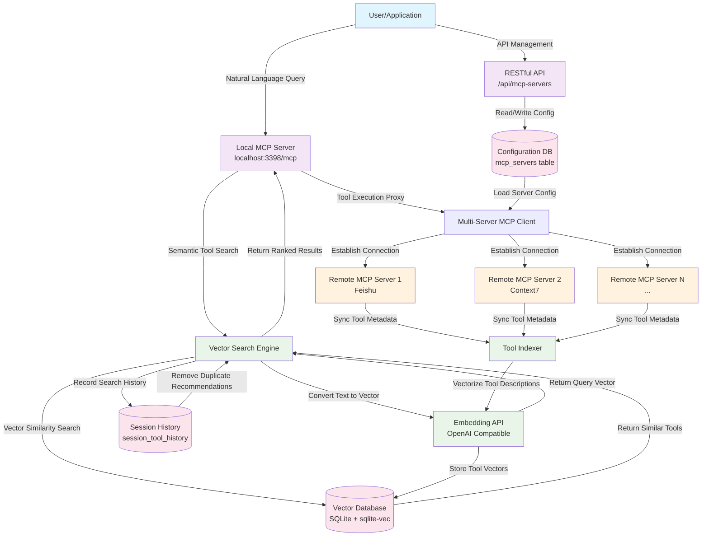

# Dext - Advanced MCP Tool Retrieval & Vector Indexing System

[中文文档](README.zh-CN.md) | English

**Dext** is an advanced MCP (Model Context Protocol) tool retrieval and vector indexing system that enables intelligent tool discovery and execution through semantic search. It features a database-driven configuration management system with RESTful API for dynamic MCP server management.

## System Architecture Overview

Dext operates as an intelligent middleware layer:

1. **Multi-Server MCP Client**: Connects to multiple remote MCP servers (Feishu, Context7, etc.) using `@langchain/mcp-adapters`
2. **Database-Driven Configuration**: SQLite-based MCP server configuration with RESTful API management
3. **Vector Database**: Automatically synchronizes remote tool metadata to local SQLite vector database
4. **Local MCP Server**: Express-based HTTP MCP server providing `retriever`, `executor`, and management APIs
5. **Intelligent Search Engine**: Runs vectorization and vector search self-checks when Embedding API is configured

### Dext Workflow Diagram



### Key Workflow Steps

1. **Configuration Management**: MCP servers are managed through database and RESTful API
2. **Dynamic Loading**: System loads server configurations from database on startup
3. **Query Processing**: User sends natural language queries to the local MCP server
4. **Tool Retrieval**: The `retriever` tool vectorizes the query and searches for semantically similar tools
5. **Tool Execution**: The `executor` tool proxies requests to appropriate remote MCP servers
6. **Continuous Indexing**: Tool metadata from remote servers is automatically synchronized and vectorized
7. **Session Management**: Search history is tracked to avoid duplicate tool recommendations

> 💡 This project demonstrates advanced approaches to tool management in modern AI systems, combining semantic search, vector databases, and database-driven configuration management.

## Core Capabilities

- **Database-Driven Configuration**: SQLite-based MCP server configuration with no config files
- **RESTful API Management**: Complete CRUD API for MCP server configuration
- **Multi-Server MCP Client**: Based on `MultiServerMCPClient`, supports OAuth callbacks, SSE/HTTP transport
- **Local MCP Server**: Express-based HTTP MCP server providing `/mcp` endpoint and management APIs
- **Tool Vector Indexing & Retrieval**: Vector search using `better-sqlite3` and `sqlite-vec`
- **Session-Level History**: Search history tracking to avoid duplicate tool recommendations
- **Group-Aware Routing**: Tag MCP servers into named groups, filter retrieval by group names, and manage group membership via API
- **Migration Support**: Tools for migrating from legacy configuration files

## Project Structure

```
├── index.js                  # Entry point: bootstrap MCP client and server startup sequence
├── lib/
│   ├── embedding.js          # Shared embedding helpers for vectorization routines
│   └── mcpClient.js          # MCP client initialization and environment interpolation utilities
├── scripts/
│   └── diagnostics.js        # Optional diagnostics to validate embeddings and vector search
├── mcp-server.js             # Local MCP server (Express + MCP SDK) + RESTful API
├── vector_search.js          # Tool vectorization and retrieval logic
├── database.js               # SQLite + sqlite-vec manager
├── database_schema.sql       # Database schema script
├── migrate-mcp-servers.js    # Migration utility (deprecated, for legacy configs only)
├── MIGRATION_README.md       # Database API documentation
├── tools_vector.db           # Runtime-generated SQLite database
├── .env.example              # Environment variable template
├── package.json              # NPM scripts and dependencies
└── README.md                 # Current documentation
```

`tools_vector.db` is automatically created on first run; it contains both vector search data and MCP server configurations.

## Quick Start

### 1. Prerequisites
- Node.js ≥ 18 (ESM and `Float32Array` support)
- Optional: Embedding API access credentials

### 2. Install Dependencies

```bash
npm install
```

### 3. Configure Environment Variables
- Copy `.env.example` to `.env`
- Fill in the variables from the table below (at minimum set `EMBEDDING_NG_API_KEY` and a strong `ADMIN_API_KEY`).
  Legacy variables with the `EMBEDDING_` prefix are still read for backward compatibility, but new deployments should prefer the `EMBEDDING_NG_` naming.

| Variable | Description | Default | Required |
| -------- | ----------- | ------- | -------- |
| `EMBEDDING_NG_API_KEY` | OpenAI compatible Embedding API key | - | ✅ |
| `EMBEDDING_NG_BASE_URL` | Embedding API Base URL | - | ❌ |
| `EMBEDDING_NG_MODEL_NAME` | Embedding model name | `doubao-embedding-text-240715` | ❌ |
| `EMBEDDING_NG_VECTOR_DIMENSION` | Vector dimension | `1024` | ❌ |
| `MCP_CALLBACK_PORT` | OAuth callback listening port | `12334` | ❌ |
| `MCP_SERVER_PORT` | Local MCP HTTP service listening port | `3398` | ❌ |
| `TOOLS_DB_PATH` | Custom path for the SQLite database file | `<project>/tools_vector.db` | ❌ |
| `TOOL_RETRIEVER_TOP_K` | Default number of tools returned by `retriever` | `5` | ❌ |
| `TOOL_RETRIEVER_THRESHOLD` | Minimum similarity threshold | `0.1` | ❌ |
| `ADMIN_API_KEY` | Secret required to access `/api` administration endpoints | - | ✅ |
| `ALLOW_UNAUTHENTICATED_API` | Set to `true` to bypass API key checks (development only) | `false` | ❌ |
| `ALLOWED_ORIGINS` | Comma separated CORS allowlist | `http://localhost:3398` | ❌ |
| `ADMIN_RATE_LIMIT_WINDOW_MS` | Rate limiting window for admin API (milliseconds) | `60000` | ❌ |
| `ADMIN_RATE_LIMIT_MAX` | Maximum requests per window per client IP | `120` | ❌ |
| `LOG_LEVEL` | Structured log level (`trace` → `fatal`) | `info` | ❌ |
| `VECTORIZE_CONCURRENCY` | Number of parallel workers used when embedding tools | `4` | ❌ |

> ℹ️ The bootstrapper first looks for `.env` in the project root and then falls back to `data/.env`, enabling the Docker Compose workflow described below without extra configuration.

### 4. Start Service

```bash
npm start
```

The system will:
- Initialize the SQLite database with MCP server configurations
- Load 12 pre-configured MCP servers from the database
- Start the local MCP server at `http://localhost:3398/mcp`
- Provide a secured RESTful API at `http://localhost:3398/api/...` (requires `ADMIN_API_KEY`)

## Testing

Run the automated unit and integration checks with the built-in Node.js test runner:

```bash
LOG_LEVEL=error npm test
```

> ℹ️ The integration suite starts a real MCP server instance and will be skipped automatically when the `better-sqlite3` native bindings are not available (for example, on platforms where prebuilt binaries are missing).

## Observability

- **Structured logging** – all application logs are emitted as JSON with request context. Adjust verbosity with `LOG_LEVEL` (`trace`, `debug`, `info`, `warn`, `error`, `fatal`).
- **Request logging middleware** – every HTTP call records method, URL, status code, and latency.
- **Prometheus metrics** – scrape `GET /metrics` to collect `http_request_duration_seconds` histograms segmented by method, route, and status code.

## Containerized Deployment

Build and run the service using Docker:

```bash
# Build image
docker build -t dextmcp .

# Start with docker-compose (persists SQLite data in ./data)
docker compose up -d
```

To mirror the integration workflow:

1. Create a `data/` directory in the project root and move your `.env` file there (it will be mounted into the container).
2. Start any remote MCP servers behind ToolHive and record their proxy URLs.
3. Launch the stack with `docker compose up -d`; the service exposes MCP + admin APIs at `http://localhost:3398`.
4. Use the admin API to update server entries so they point at the ToolHive proxy URLs.

The compose file maps the MCP server to `localhost:3398`, mounts `./data` into `/usr/src/app/data` for the SQLite database and environment file, and surfaces the same environment variables described above for secure configuration.

## MCP Server & Group Management API

### RESTful API Endpoints

All MCP server configurations are managed through RESTful API (responses include a `group_names` array showing current memberships). Supply the `x-api-key` header (value: `ADMIN_API_KEY`) with every request. Requests that exceed the configured rate limits return `429 Too Many Requests`.

#### Get All Servers
```bash
curl -H "x-api-key: $ADMIN_API_KEY" http://localhost:3398/api/mcp-servers
curl -H "x-api-key: $ADMIN_API_KEY" "http://localhost:3398/api/mcp-servers?enabled=true&server_type=http"
```

#### Get Specific Server
```bash
curl -H "x-api-key: $ADMIN_API_KEY" http://localhost:3398/api/mcp-servers/1
```

#### Create New Server
```bash
# STDIO Server
curl -X POST http://localhost:3398/api/mcp-servers \
  -H "Content-Type: application/json" \
  -H "x-api-key: $ADMIN_API_KEY" \
  -d '{
    "server_name": "my-stdio-server",
    "server_type": "stdio",
    "command": "npx",
    "args": ["my-package"],
    "description": "My custom MCP server",
    "group_names": ["devtools"]
  }'

# HTTP Server
curl -X POST http://localhost:3398/api/mcp-servers \
  -H "Content-Type: application/json" \
  -H "x-api-key: $ADMIN_API_KEY" \
  -d '{
    "server_name": "my-http-server",
    "server_type": "http",
    "url": "https://example.com/mcp",
    "headers": {
      "Authorization": "Bearer token"
    },
    "description": "HTTP MCP server",
    "group_names": ["docs", "devtools"]
  }'
```

#### Update Server
```bash
curl -X PATCH http://localhost:3398/api/mcp-servers/1 \
  -H "Content-Type: application/json" \
  -H "x-api-key: $ADMIN_API_KEY" \
  -d '{
    "description": "Updated description",
    "enabled": false,
    "group_names": ["devtools"]
  }'
```

#### Add Server to Groups
```bash
curl -X POST http://localhost:3398/api/mcp-servers/1/groups \
  -H "Content-Type: application/json" \
  -H "x-api-key: $ADMIN_API_KEY" \
  -d '{
    "group_names": ["devtools", "docs"]
  }'
```

#### Remove Server from Groups
```bash
curl -X DELETE http://localhost:3398/api/mcp-servers/1/groups \
  -H "Content-Type: application/json" \
  -H "x-api-key: $ADMIN_API_KEY" \
  -d '{
    "group_names": ["docs"]
  }'
```

#### Delete Server
```bash
curl -X DELETE http://localhost:3398/api/mcp-servers/1 \
  -H "x-api-key: $ADMIN_API_KEY"
```

#### Trigger Tool Sync
```bash
curl -X POST http://localhost:3398/api/sync \
  -H "x-api-key: $ADMIN_API_KEY"
```

Use this endpoint whenever remote MCP servers add, update, or remove tools. The call refreshes the vector index without restarting the local service.

### Group Management

Use the following endpoints to organize MCP servers into named groups:

```bash
# List all groups with server counts
curl -H "x-api-key: $ADMIN_API_KEY" http://localhost:3398/api/mcp-groups

# Create a new group
curl -X POST http://localhost:3398/api/mcp-groups \
  -H "Content-Type: application/json" \
  -H "x-api-key: $ADMIN_API_KEY" \
  -d '{
    "group_name": "devtools",
    "description": "Developer tooling servers"
  }'

# Update a group
curl -X PATCH http://localhost:3398/api/mcp-groups/1 \
  -H "Content-Type: application/json" \
  -H "x-api-key: $ADMIN_API_KEY" \
  -d '{
    "description": "Updated description"
  }'

# Delete a group
curl -X DELETE http://localhost:3398/api/mcp-groups/1 \
  -H "x-api-key: $ADMIN_API_KEY"
```

### Security Hardening

- **API key authentication**: Set `ADMIN_API_KEY` and include it as the `x-api-key` header for every `/api` request. Set `ALLOW_UNAUTHENTICATED_API=true` only for local experiments.
- **Rate limiting**: Adjust `ADMIN_RATE_LIMIT_WINDOW_MS` and `ADMIN_RATE_LIMIT_MAX` to throttle abusive clients. When the limit is exceeded the server returns HTTP 429.
- **CORS allowlist**: Restrict browser access to trusted front-ends by configuring `ALLOWED_ORIGINS` (comma separated list). Requests from other origins are rejected with HTTP 403.

### Database Schema

MCP servers are stored in the `mcp_servers` table:

```sql
CREATE TABLE mcp_servers (
    id INTEGER PRIMARY KEY AUTOINCREMENT,
    server_name TEXT NOT NULL UNIQUE,
    server_type TEXT NOT NULL CHECK (server_type IN ('http', 'stdio')),
    url TEXT,
    command TEXT,
    args TEXT,  -- JSON format
    headers TEXT, -- JSON format
    env TEXT, -- JSON format
    description TEXT,
    enabled INTEGER DEFAULT 1,
    created_at DATETIME DEFAULT CURRENT_TIMESTAMP,
    updated_at DATETIME DEFAULT CURRENT_TIMESTAMP
);
```

Additional tables manage group metadata and relationships:

```sql
CREATE TABLE mcp_groups (
    id INTEGER PRIMARY KEY AUTOINCREMENT,
    group_name TEXT NOT NULL UNIQUE,
    description TEXT,
    created_at DATETIME DEFAULT CURRENT_TIMESTAMP,
    updated_at DATETIME DEFAULT CURRENT_TIMESTAMP
);

CREATE TABLE mcp_server_groups (
    server_id INTEGER NOT NULL,
    group_id INTEGER NOT NULL,
    PRIMARY KEY (server_id, group_id),
    FOREIGN KEY (server_id) REFERENCES mcp_servers(id) ON DELETE CASCADE,
    FOREIGN KEY (group_id) REFERENCES mcp_groups(id) ON DELETE CASCADE
);
```

## MCP Tools API

After startup, the local MCP server provides the following tools at `http://localhost:3398/mcp`:

### 1. `retriever` - Semantic Tool Search
Retrieve the most relevant tools based on natural language descriptions.

```javascript
// Call using MCP client
const results = await client.call("retriever", {
  descriptions: ["I want to insert a timeline in a Feishu document"],
  sessionId: "abc123",  // 6-digit session ID, optional
  serverNames: ["feishu"], // Optional: filter by specific servers
  groupNames: ["devtools"] // Optional: filter by server groups
});

// Return format
{
  "session_id": "abc123",
  "new_tools": [
    {
      "query_index": 0,
      "query": "I want to insert a timeline in a Feishu document",
      "tools": [
        {
          "rank": 1,
          "tool_name": "feishu__docx_block_create",
          "md5": "abc123...",
          "description": "Create blocks in Feishu documents",
          "similarity": 0.8943,
          "input_schema": "{...}",
          "output_schema": "{...}"
        }
      ]
    }
  ],
  "known_tools": [...],  // Previously retrieved tools in this session
  "summary": {
    "new_tools_count": 3,
    "known_tools_count": 2,
    "session_history_count": 5
  },
  "server_description": "Available servers: feishu(Feishu document server), context7(Context7 API)"
}
```

### 2. `executor` - Tool Execution Proxy
Proxy execute remote MCP tools.

```javascript
const result = await client.call("executor", {
  md5: "abc123...",
  parameters: {
    documentId: "doc_456",
    blockType: "timeline",
    content: {...}
  }
});
```

### 3. `greeting` Resource
Sample resource for testing.

```javascript
const greeting = await client.getResource("greeting://World");
// Returns: "Hello, World!"
```

## Advanced Usage

### Database Direct Access

```javascript
import VectorDatabase from './database.js';

const db = new VectorDatabase();
await db.initialize();

// Get all enabled MCP servers
const servers = db.db.prepare('SELECT * FROM mcp_servers WHERE enabled = 1').all();

// Search similar tools
const results = db.searchSimilarVectors(queryVector, 5, 0.2, ['feishu']);

// Get session history
const history = db.getSessionHistory('abc123');

// Close database
await db.close();
```

### Configuration Management

```javascript
// View current configuration
import sqlite3 from 'better-sqlite3';
const db = sqlite3('tools_vector.db');
const servers = db.prepare('SELECT server_name, server_type, url, command FROM mcp_servers WHERE enabled = 1').all();
console.log(servers);
db.close();
```

## Troubleshooting

### Common Issues

1. **MCP Client Initialization Failed**
   - Check database file exists and has proper permissions
   - Verify there are enabled servers in the database
   - Check application logs for detailed error messages

2. **Servers Cannot Connect**
   - Verify server configurations are correct (URL, command, arguments)
   - Check network connectivity and firewall settings
   - Use API to update server configurations

3. **API Not Accessible**
   - Ensure MCP server is running
   - Check port configuration (default: 3398)
   - Test health endpoint: `GET /health`

### Debug Commands

```bash
# Check database content
sqlite3 tools_vector.db "SELECT server_name, server_type FROM mcp_servers WHERE enabled = 1;"

# Test API health
curl http://localhost:3398/health

# View enabled servers
curl "http://localhost:3398/api/mcp-servers?enabled=true"
```

### Migration from Legacy Config

If you have legacy `mcp-servers.json` files:

```bash
# Run migration script (deprecated, for legacy use only)
node migrate-mcp-servers.js
```

The script will:
- Read the old configuration file
- Migrate configurations to the database
- Create a backup of the original file
- Skip existing configurations

## Architecture Benefits

1. **Dynamic Configuration**: Modify MCP server configurations at runtime without application restart
2. **Data Persistence**: SQLite database provides reliable configuration storage and complex queries
3. **RESTful API**: Complete management interface for integration with other systems
4. **Configuration Validation**: Built-in data validation and error handling
5. **Version Control**: Database includes creation and update timestamps for change tracking

## License

MIT