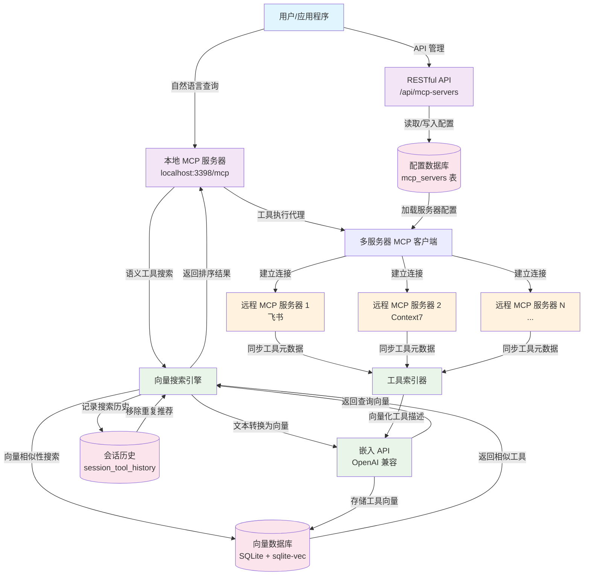

# Dext - 高级 MCP 工具检索与向量索引系统

中文 | [English](README.md)

**Dext** 是一个先进的 MCP (Model Context Protocol) 工具检索与向量索引系统，通过智能语义搜索实现工具发现和执行。它采用数据库驱动的配置管理系统，提供 RESTful API 进行动态 MCP 服务器管理。

## 系统架构概览

Dext 作为一个智能中间层运行：

1. **多服务器 MCP 客户端**：使用 `@langchain/mcp-adapters` 连接多个远程 MCP 服务器（飞书、Context7 等）
2. **数据库驱动配置**：基于 SQLite 的 MCP 服务器配置与 RESTful API 管理
3. **向量数据库**：自动同步远程工具元数据到本地 SQLite 向量数据库
4. **本地 MCP 服务端**：基于 Express 的 HTTP MCP 服务端，提供 `retriever`、`executor` 和管理 API
5. **智能检索引擎**：在配置 Embedding API 后运行向量化与向量搜索的自检流程

### Dext 工作流程图



### 关键工作流程步骤

1. **配置管理**：MCP 服务器通过数据库和 RESTful API 进行管理
2. **动态加载**：系统在启动时从数据库加载服务器配置
3. **查询处理**：用户向本地 MCP 服务器发送自然语言查询
4. **工具检索**：`retriever` 工具将查询向量化并搜索语义相似的工具有
5. **工具执行**：`executor` 工具将请求代理到适当的远程 MCP 服务器
6. **持续索引**：远程服务器的工具元数据自动同步并向量化
7. **会话管理**：跟踪搜索历史以避免重复工具推荐

> 💡 本项目展示了现代 AI 系统中工具管理的先进方法，结合了语义搜索、向量数据库和数据库驱动的配置管理。

## 核心能力

- **数据库驱动配置**：基于 SQLite 的 MCP 服务器配置，无需配置文件
- **RESTful API 管理**：完整的 MCP 服务器配置 CRUD API
- **多服务器 MCP 客户端**：基于 `MultiServerMCPClient`，支持 OAuth 回调、SSE/HTTP 传输等能力
- **本地 MCP 服务端**：基于 Express 的 HTTP MCP 服务端，提供 `/mcp` 端点和管理 API
- **工具向量索引与检索**：使用 `better-sqlite3` 和 `sqlite-vec` 进行向量搜索
- **Session 级历史**：搜索历史跟踪，避免重复工具推荐
- **迁移支持**：提供从遗留配置文件迁移的工具

## 项目结构

```
├── index.js                  # 入口：负责引导 MCP 客户端并启动服务
├── lib/
│   ├── embedding.js          # 向量化相关的通用工具函数
│   └── mcpClient.js          # MCP 客户端初始化与环境变量占位符解析
├── scripts/
│   └── diagnostics.js        # 可选的诊断脚本，用于验证向量化与搜索流程
├── mcp-server.js             # 本地 MCP 服务端 (Express + MCP SDK) + RESTful API
├── vector_search.js          # 工具向量化与检索逻辑
├── database.js               # SQLite + sqlite-vec 管理器
├── database_schema.sql       # 数据库建表脚本
├── migrate-mcp-servers.js    # 迁移工具（已弃用，仅用于遗留配置）
├── MIGRATION_README.md       # 数据库 API 文档
├── tools_vector.db           # 运行时生成的 SQLite 数据库
├── .env.example              # 环境变量模板
├── package.json              # NPM 脚本与依赖
└── README.md                 # 英文文档
```

`tools_vector.db` 会在首次运行时自动创建；它包含向量搜索数据和 MCP 服务器配置。

## 快速开始

### 1. 准备环境
- Node.js ≥ 18（ESM 与 `Float32Array` 支持）
- 可选：准备好 Embedding API 的访问凭证

### 2. 安装依赖

```bash
npm install
```

### 3. 配置环境变量
- 复制 `.env.example` 为 `.env`
- 按需填写下表中的变量（至少配置 `EMBEDDING_API_KEY` 和一个足够复杂的 `ADMIN_API_KEY`）

| 变量名 | 说明 | 默认值 | 必需 |
| ------ | ---- | ------ | ---- |
| `EMBEDDING_NG_API_KEY` | OpenAI 兼容 Embedding API 密钥 | - | ✅ |
| `EMBEDDING_NG_BASE_URL` | Embedding API Base URL | - | ❌ |
| `EMBEDDING_NG_MODEL_NAME` | Embedding 模型名称 | `doubao-embedding-text-240715` | ❌ |
| `EMBEDDING_NG_VECTOR_DIMENSION` | 向量维度 | `1024` | ❌ |
| `MCP_CALLBACK_PORT` | OAuth 回调监听端口 | `12334` | ❌ |
| `MCP_SERVER_PORT` | 本地 MCP HTTP 服务监听端口 | `3000` | ❌ |
| `TOOLS_DB_PATH` | 自定义 SQLite 数据库文件路径 | `<project>/tools_vector.db` | ❌ |
| `TOOL_RETRIEVER_TOP_K` | `retriever` 默认返回的工具数量 | `5` | ❌ |
| `TOOL_RETRIEVER_THRESHOLD` | 最低相似度阈值 | `0.1` | ❌ |
| `ADMIN_API_KEY` | 访问 `/api` 管理端点所需的密钥 | - | ✅ |
| `ALLOW_UNAUTHENTICATED_API` | 设为 `true` 可跳过密钥校验（仅限本地调试） | `false` | ❌ |
| `ALLOWED_ORIGINS` | 允许的 CORS 来源列表（逗号分隔） | `http://localhost:3000` | ❌ |
| `ADMIN_RATE_LIMIT_WINDOW_MS` | 管理 API 限流窗口（毫秒） | `60000` | ❌ |
| `ADMIN_RATE_LIMIT_MAX` | 每个客户端在窗口内允许的请求数 | `120` | ❌ |
| `VECTORIZE_CONCURRENCY` | 工具向量化并发工作数 | `4` | ❌ |

### 4. 启动服务

```bash
npm start
```

系统将会：
- 初始化包含 MCP 服务器配置的 SQLite 数据库
- 从数据库加载 12 个预配置的 MCP 服务器
- 在 `http://localhost:3000/mcp` 启动本地 MCP 服务器
- 在 `http://localhost:3000/api/...` 提供需要 `ADMIN_API_KEY` 的安全 RESTful API

## MCP 服务器管理 API

### RESTful API 端点

所有 MCP 服务器配置都通过 RESTful API 进行管理。每个请求必须携带 `x-api-key` 请求头，其值为配置的 `ADMIN_API_KEY`，否则服务器会返回 `401 Unauthorized`。触发限流时会返回 `429 Too Many Requests`。

#### 获取所有服务器
```bash
curl -H "x-api-key: $ADMIN_API_KEY" http://localhost:3000/api/mcp-servers
curl -H "x-api-key: $ADMIN_API_KEY" "http://localhost:3000/api/mcp-servers?enabled=true&server_type=http"
```

#### 获取特定服务器
```bash
curl -H "x-api-key: $ADMIN_API_KEY" http://localhost:3000/api/mcp-servers/1
```

#### 创建新服务器
```bash
# STDIO 服务器
curl -X POST http://localhost:3398/api/mcp-servers \
  -H "Content-Type: application/json" \
  -H "x-api-key: $ADMIN_API_KEY" \
  -d '{
    "server_name": "my-stdio-server",
    "server_type": "stdio",
    "command": "npx",
    "args": ["my-package"],
    "description": "我的自定义 MCP 服务器"
  }'

# HTTP 服务器
curl -X POST http://localhost:3398/api/mcp-servers \
  -H "Content-Type: application/json" \
  -H "x-api-key: $ADMIN_API_KEY" \
  -d '{
    "server_name": "my-http-server",
    "server_type": "http",
    "url": "https://example.com/mcp",
    "headers": {
      "Authorization": "Bearer token"
    },
    "description": "HTTP MCP 服务器"
  }'
```

#### 更新服务器
```bash
curl -X PATCH http://localhost:3000/api/mcp-servers/1 \
  -H "Content-Type: application/json" \
  -H "x-api-key: $ADMIN_API_KEY" \
  -d '{
    "description": "更新后的描述",
    "enabled": false
  }'
```

#### 删除服务器
```bash
curl -X DELETE http://localhost:3000/api/mcp-servers/1 \
  -H "x-api-key: $ADMIN_API_KEY"
```

### 安全加固

- **API 密钥认证**：设置 `ADMIN_API_KEY` 并在每个 `/api` 请求中通过 `x-api-key` 头部发送。`ALLOW_UNAUTHENTICATED_API=true` 仅建议在本地调试时使用。
- **限流配置**：通过 `ADMIN_RATE_LIMIT_WINDOW_MS` 与 `ADMIN_RATE_LIMIT_MAX` 控制访问频率，超过阈值会得到 429 响应。
- **CORS 白名单**：在 `ALLOWED_ORIGINS` 中配置受信任的前端来源，未列出的来源会收到 403。

### 数据库架构

MCP 服务器存储在 `mcp_servers` 表中：

```sql
CREATE TABLE mcp_servers (
    id INTEGER PRIMARY KEY AUTOINCREMENT,
    server_name TEXT NOT NULL UNIQUE,
    server_type TEXT NOT NULL CHECK (server_type IN ('http', 'stdio')),
    url TEXT,
    command TEXT,
    args TEXT,  -- JSON 格式
    headers TEXT, -- JSON 格式
    env TEXT, -- JSON 格式
    description TEXT,
    enabled INTEGER DEFAULT 1,
    created_at DATETIME DEFAULT CURRENT_TIMESTAMP,
    updated_at DATETIME DEFAULT CURRENT_TIMESTAMP
);
```

## MCP 工具 API

启动后，本地 MCP 服务器将在 `http://localhost:3398/mcp` 提供以下工具：

### 1. `retriever` - 语义工具搜索
根据自然语言描述检索最相关的工具。

```javascript
// 使用 MCP 客户端调用
const results = await client.call("retriever", {
  descriptions: ["我想在飞书文档中插入时间轴"],
  sessionId: "abc123",  // 6位会话 ID，可选
  serverNames: ["feishu"]  // 可选：按特定服务器过滤
});

// 返回格式
{
  "session_id": "abc123",
  "new_tools": [
    {
      "query_index": 0,
      "query": "我想在飞书文档中插入时间轴",
      "tools": [
        {
          "rank": 1,
          "tool_name": "feishu__docx_block_create",
          "md5": "abc123...",
          "description": "在飞书文档中创建块",
          "similarity": 0.8943,
          "input_schema": "{...}",
          "output_schema": "{...}"
        }
      ]
    }
  ],
  "known_tools": [...],  // 此会话中已检索过的工具
  "summary": {
    "new_tools_count": 3,
    "known_tools_count": 2,
    "session_history_count": 5
  },
  "server_description": "可用服务器：feishu(飞书文档服务器), context7(Context7 API)"
}
```

### 2. `executor` - 工具执行代理
代理执行远程 MCP 工具。

```javascript
const result = await client.call("executor", {
  md5: "abc123...",
  parameters: {
    documentId: "doc_456",
    blockType: "timeline",
    content: {...}
  }
});
```

### 3. `greeting` 资源
用于测试的示例资源。

```javascript
const greeting = await client.getResource("greeting://World");
// 返回: "Hello, World!"
```

## 高级用法

### 数据库直接访问

```javascript
import VectorDatabase from './database.js';

const db = new VectorDatabase();
await db.initialize();

// 获取所有启用的 MCP 服务器
const servers = db.db.prepare('SELECT * FROM mcp_servers WHERE enabled = 1').all();

// 搜索相似工具
const results = db.searchSimilarVectors(queryVector, 5, 0.2, ['feishu']);

// 获取会话历史
const history = db.getSessionHistory('abc123');

// 关闭数据库
await db.close();
```

### 配置管理

```javascript
// 查看当前配置
import sqlite3 from 'better-sqlite3';
const db = sqlite3('tools_vector.db');
const servers = db.prepare('SELECT server_name, server_type, url, command FROM mcp_servers WHERE enabled = 1').all();
console.log(servers);
db.close();
```

## 故障排除

### 常见问题

1. **MCP 客户端初始化失败**
   - 检查数据库文件是否存在且有正确权限
   - 确认数据库中有启用的服务器配置
   - 查看应用日志中的详细错误信息

2. **服务器无法连接**
   - 确认服务器配置正确（URL、命令、参数等）
   - 检查网络连接和防火墙设置
   - 使用 API 更新服务器配置

3. **API 无法访问**
   - 确保 MCP 服务器正在运行
   - 检查端口配置（默认：3398）
   - 测试健康检查端点：`GET /health`

### 调试命令

```bash
# 检查数据库内容
sqlite3 tools_vector.db "SELECT server_name, server_type FROM mcp_servers WHERE enabled = 1;"

# 测试 API 健康状态
curl http://localhost:3398/health

# 查看启用的服务器
curl "http://localhost:3398/api/mcp-servers?enabled=true"
```

### 从遗留配置迁移

如果您有遗留的 `mcp-servers.json` 文件：

```bash
# 运行迁移脚本（已弃用，仅用于遗留配置）
node migrate-mcp-servers.js
```

脚本将会：
- 读取旧配置文件
- 将配置迁移到数据库
- 创建原文件的备份
- 跳过已存在的配置

## 架构优势

1. **动态配置**：在运行时修改 MCP 服务器配置，无需重启应用程序
2. **数据持久化**：SQLite 数据库提供可靠的配置存储和复杂查询
3. **RESTful API**：完整的管理接口，便于与其他系统集成
4. **配置验证**：内置数据验证和错误处理
5. **版本控制**：数据库包含创建和更新时间戳，支持变更追踪

## License

MIT