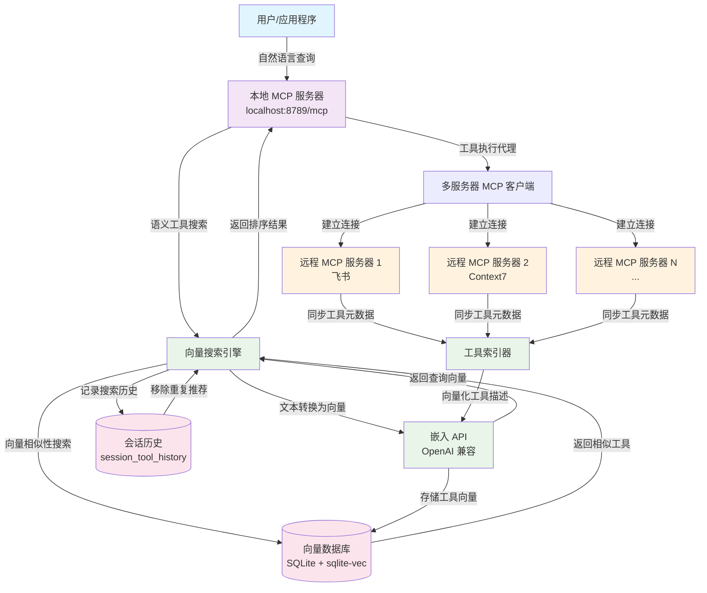

# Dext - 高级 MCP 工具检索与向量索引系统

中文 | [English](README.md)

**Dext** 是一个先进的 MCP (Model Context Protocol) 工具检索与向量索引系统，通过智能语义搜索实现工具发现和执行。它在远程 MCP 服务器和本地客户端之间构建了桥梁，提供基于向量嵌入的语义工具搜索能力。

## 系统架构概览

Dext 作为一个智能中间层运行：

1. **多服务器 MCP 客户端**：使用 `@langchain/mcp-adapters` 连接多个远程 MCP 服务器（飞书、Context7 等）
2. **向量数据库**：自动同步远程工具元数据到本地 SQLite 向量数据库
3. **本地 MCP 服务端**：基于 Express 的 HTTP MCP 服务端，提供 `retriever`、`executor` 等工具能力
4. **智能检索引擎**：在配置 Embedding API 后运行向量化与向量搜索的自检流程

### Dext 工作流程图



### 关键工作流程步骤

1. **查询处理**：用户向本地 MCP 服务器发送自然语言查询
2. **工具检索**：`retriever` 工具将查询向量化并搜索语义相似的工具有
3. **工具执行**：`executor` 工具将请求代理到适当的远程 MCP 服务器
4. **持续索引**：远程服务器的工具元数据自动同步并向量化
5. **会话管理**：跟踪搜索历史以避免重复工具推荐

> 💡 本项目展示了现代 AI 系统中工具管理的先进方法，结合了语义搜索、向量数据库和 MCP 协议集成。

## 核心能力

- **多服务器 MCP 客户端**：基于 `MultiServerMCPClient`，支持 OAuth 回调、SSE/HTTP 传输等能力。
- **本地 MCP 服务端**：`mcp-server.js` 通过 Express 提供 `/mcp` 端点，可被任何符合 Model Context Protocol 的客户端调用。
- **工具向量索引与检索**：`vector_search.js` + `database.js` 利用 `better-sqlite3` 和 `sqlite-vec` 保存与召回工具描述向量。
- **工具推荐 API**：`tool_recommender.js` 对外暴露模块化的推荐接口，可在其他代码中直接调用。
- **自动向量库维护**：新增工具会计算 MD5，并在阈值内清理高度相似的旧数据，保持索引干净。
- **Session 级历史**：`retriever` 工具记录会话历史，避免重复返回同一个工具。

## 项目结构

```
├── index.js                # 入口：初始化 MCP 客户端、向量测试、启动服务端
├── mcp-server.js           # 本地 MCP 服务端 (Express + MCP SDK)
├── vector_search.js        # 工具向量化与检索逻辑
├── tool_recommender.js     # 面向应用的工具推荐封装
├── database.js             # SQLite + sqlite-vec 管理器
├── database_schema.sql     # 数据库建表脚本
├── tools_vector.db         # 运行时生成的向量数据库
├── .env.example            # 环境变量模板
├── package.json            # NPM 脚本与依赖
└── README.md               # 当前文档
```

`tools_vector.db` 会在首次运行时自动创建；若需要重建索引，可直接删除该文件或调用 `VectorSearch.clearIndex()`。

## 快速开始

1. **准备环境**
   - Node.js ≥ 18（ESM 与 `Float32Array` 支持）。
   - 可选：准备好 Embedding API 的访问凭证。

2. **安装依赖**

   ```bash
   npm install
   ```

3. **配置环境变量**
   - 复制 `.env.example` 为 `.env`。
   - 按需填写下表中的变量（至少需要 `EMBEDDING_API_KEY` 才能真正执行向量化）。

   | 变量名 | 说明 | 默认值 | 必需 |
   | ------ | ---- | ------ | ---- |
   | `EMBEDDING_API_KEY` | OpenAI 兼容 Embedding API 密钥 | - | ✅ |
   | `EMBEDDING_BASE_URL` | Embedding API Base URL | - | ❌ |
   | `EMBEDDING_MODEL_NAME` | Embedding 模型名称 | - | ❌ |
   | `EMBEDDING_VECTOR_DIMENSION` | 向量维度 | `1024` | ❌ |
   | `MCP_SERVER_URL` | 远程 MCP 服务器（示例：飞书）入口 | `http://localhost:8788/mcp` | ❌ |
   | `MCP_CALLBACK_PORT` | OAuth 回调监听端口 | `12334` | ❌ |
   | `MCP_SERVER_PORT` | 本地 MCP HTTP 服务监听端口 | `8789` | ❌ |
   | `TOOL_RETRIEVER_TOP_K` | `retriever` 默认返回的工具数量 | `3` | ❌ |
   | `TOOL_RETRIEVER_THRESHOLD` | 最低相似度阈值 | `0.1` | ❌ |

   ### 支持的 Embedding API

   - **OpenAI 兼容 API**：任何兼容 OpenAI API 格式的 Embedding 服务
   - **自动检测**：系统会自动检测 API 类型并适配

   > 🔧 **注意**：Context7 的 API 配置目前在 `index.js` 中设置，生产环境建议通过环境变量管理。

4. **启动服务**

   ```bash
   npm start
   ```

   控制台日志会显示：
   - MCP 客户端是否成功连接远程服务器及其工具列表。
   - 向量数据库初始化与自检结果。
   - 本地 MCP 服务端监听地址（例如 `http://localhost:3000/mcp`）。

## 运行时行为

- **入口脚本**：`index.js`
  1. 打印基础欢迎信息与 `greet()` 示例输出。
  2. 初始化多服务器 MCP 客户端，并将工具列表写入 `global.mcpToolsInfo`。
  3. 启动本地 MCP 服务端（`mcp-server.js`）。
  4. 根据是否配置了 `EMBEDDING_API_KEY` 决定执行向量化自检或仅初始化数据库。

- **本地 MCP 服务端**：`mcp-server.js`
  - `retriever`：根据自然语言描述检索匹配工具，自动区分"新工具"与"已推荐工具"，并返回建议保存的 `session_id`。
  - `executor`：接收工具 MD5 + 参数，代理远程 MCP 工具调用。
    - 同时注册了一个示例资源 `greeting://{name}`。

- **向量化逻辑**：`vector_search.js`
  - `indexMCPTools()` 会调用 `vectorizeString()`（定义在 `index.js`）对工具名称 + 描述文本做 Embedding，并写入 SQLite。
  - 支持寻找高度相似的老数据并自动删除，避免重复索引。
  - `recommendTools()` 负责完整的检索流程（向量召回 → 工具匹配 → 排名输出）。

- **数据库管理**：`database.js`
  - 使用 `better-sqlite3` + `sqlite-vec` 实现高效的余弦相似度检索。
  - 表结构定义见 `database_schema.sql`，包括 `tool_vectors`、`vec_tool_embeddings`、`tool_mapping` 与 `session_tool_history`。
  - 提供会话历史查询、批量写入、索引清理等辅助方法。

## API 使用指南

### MCP 服务端 API

启动后，本地 MCP 服务器将在 `http://localhost:8789/mcp` 提供以下工具：

#### 1. `retriever` - 语义工具搜索
根据自然语言描述检索最相关的工具。

```javascript
// 使用 MCP 客户端调用
const results = await client.call("retriever", {
  query: "我想在飞书文档中插入时间轴",
  sessionId: "user_session_123",  // 可选，用于去重
  topK: 5,
  threshold: 0.2
});

// 返回格式
{
  "tools": [
    {
      "name": "feishu_insert_timeline",
      "description": "在飞书文档中插入时间轴块",
      "similarity": 0.89,
      "source": "feishu",
      "md5": "abc123..."
    }
  ],
  "new_tools": [...],  // 未推荐过的新工具
  "recommended_tools": [...],  // 已推荐过的工具
  "session_id": "user_session_123"
}
```

#### 2. `executor` - 工具执行代理
代理执行远程 MCP 工具。

```javascript
const result = await client.call("executor", {
  toolMd5: "abc123...",
  arguments: {
    documentId: "doc_456",
    timelineData: [...]
  }
});
```


### 编程接口

#### ToolRecommender 类

```javascript
import ToolRecommender from './tool_recommender.js';
import { initializeMCPClient } from './index.js';

// 初始化
const mcpClient = await initializeMCPClient();
const recommender = new ToolRecommender();
await recommender.initialize(mcpClient, { autoIndex: true });

// 单次推荐
const recommendations = await recommender.recommend('想在飞书文档插入时间轴块', {
  topK: 5,
  threshold: 0.3,
  format: 'detailed'  // simple | detailed | raw
});

// 批量推荐
const batchResults = await recommender.batchRecommend([
  '创建飞书文档',
  '插入图片',
  '分享文档'
], { topK: 3 });

// 获取最佳工具
const bestTool = await recommender.getBestTool('文档编辑', 0.5);

// 重建索引
await recommender.reindex();

// 清理资源
await recommender.close();
```

#### 输出格式选项

- **simple**: 简洁格式，只包含工具名称和描述
- **detailed**: 详细格式，包含相似度、来源、MD5 等元数据
- **raw**: 原始格式，返回完整的数据库记录

### 数据库直接访问

```javascript
import VectorDatabase from './database.js';

const db = new VectorDatabase('tools_vector.db');

// 搜索相似工具
const results = db.searchSimilarTools(queryVector, {
  limit: 10,
  threshold: 0.2,
  excludeMd5s: ['abc123']  // 排除特定工具
});

// 获取会话历史
const history = db.getSessionHistory(sessionId);

// 清理会话历史
db.clearSessionHistory(sessionId);
```

## 调试与常见操作

- **重新初始化数据库**：删除 `tools_vector.db` 或调用 `VectorSearch.clearIndex()`，下次运行会重新建表 + 建索引。
- **切换远程 MCP 服务器**：修改 `index.js` 中 `mcpServers` 配置，或自行扩展为读取环境变量。
- **查看 session 历史**：可直接调用 `VectorDatabase.getSessionHistory(sessionId)` 或在 SQLite 中查询 `session_tool_history` 表。
- **自定义日志**：项目中大量使用 `console.log`，可根据需要替换为更完善的日志框架。

## License

MIT